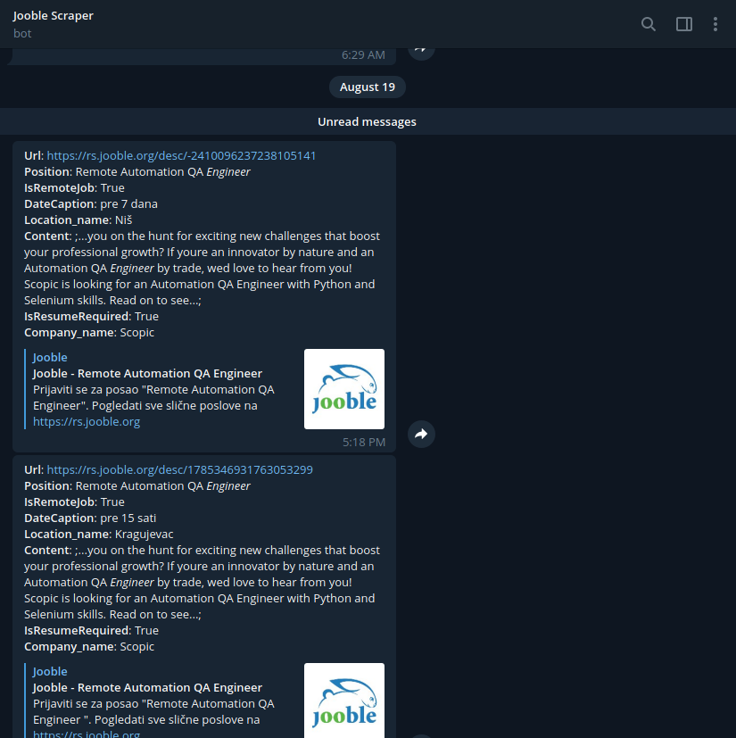

# jooble-scraper
Fetch and get notification for filtered jobs from jooble.org

## Motivation
I was searching for an internship and I came across jooble.org. Filters and search bar are present but they are not very helpful, you would often get results for jobs that are not related in any way to the thing that you searched for. Also, I didn't want to subscribe to email notification system since that also uses that same poor search functionality.

## Features 
* Search from CLI instead of visiting the website
* Filtering using regular expressions 
* Extended functionality since not all API parameters are present on the websites user interface
* Get notification for new jobs by Telegram bot (by setting up crontab whatever program that has similar functionality)
* Option to store results into a database
* Option to export results into a CSV file
* Option to customize and configure your query so you don't have to pass arguments to the script
* Option to customize output format

You can see all options by executing `python jooble.py -h`

## Screenshots

